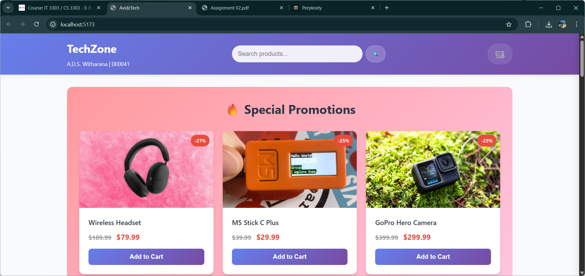
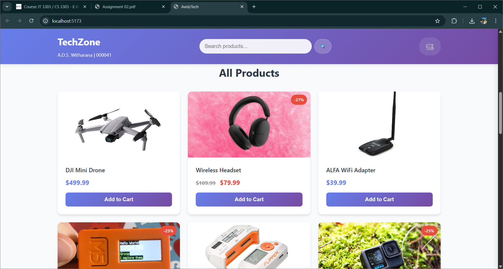
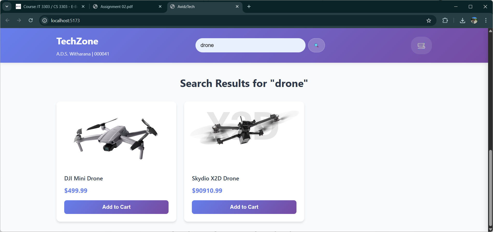
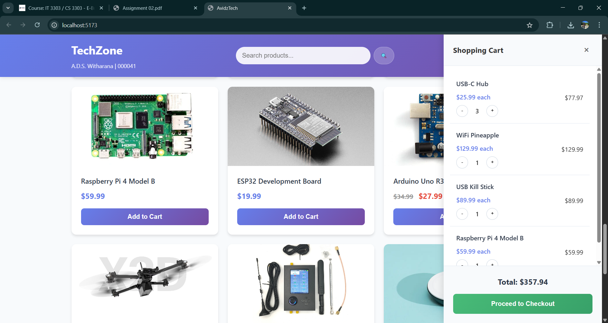
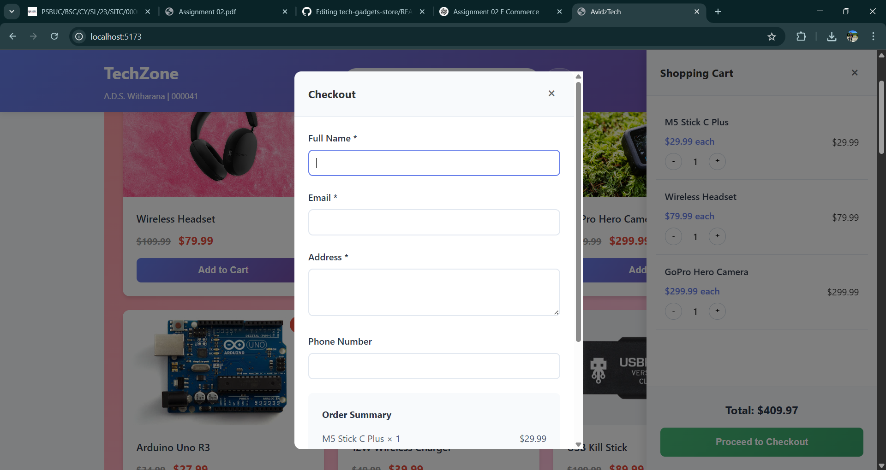

# TechZone – Online Electronics Store 🛒

Welcome to **TechZone**, a simple and responsive e-commerce website designed to sell tech gadgets like tools, headsets, and accessories online.  
📘 This project was created as **Assignment 02** for the course **CS 3303 - E-Business Systems**.

> **Technologies Used**:  
> ✅ HTML  
> ✅ CSS  
> ✅ JavaScript  
> ❌ No Backend, No Frameworks – pure client-side implementation

---

## 📚 Table of Contents
1. [Project Overview](#project-overview)
2. [Features](#features)
3. [Use Cases](#use-cases)
4. [Tools & Techniques](#tools--techniques)
5. [Screenshots](#screenshots)
6. [How to Run](#how-to-run)
7. [References](#references)

---

## 🔍 Project Overview

TechZone is a fictional online store that allows customers to:
- Browse and search products
- View promotional offers
- Add items to cart and proceed to checkout

The goal is to create a simple, user-friendly interface that simulates real-world e-commerce functions without server-side components.

---

## ✅ Features

- 🛍️ Browse & search product catalog
- 💬 View live promotions
- 🛒 Add items to cart
- 📦 Complete checkout form
- 📱 Responsive design for desktop, tablet, and mobile

---

## 🧩 Use Cases

### 1. **Browse and Search Products**
- Customers can explore products and use search filters.
- If no results are found, an appropriate message is shown.

### 2. **Add to Cart & Checkout**
- Items can be added to the cart.
- Cart preview and a full checkout form are implemented.

### 3. **View Special Promotions**
- Customers see discounts on select products (marked with a percentage badge).

---

## 🛠 Tools & Techniques

- **HTML**: Defines structure and layout of the web pages.
- **CSS**: Styles all elements including responsive layout.
- **JavaScript**: Manages product rendering, cart interaction, search filtering, and dynamic behavior.
- **Responsive Design**: Ensures usability across different screen sizes.

---

## 📸 Screenshots

> All images are stored in the `screenshots/` folder.

### 🏠 Homepage with Promotions  


### 🧾 All Products Page  


### 🔎 Search Functionality  


### 🛒 Cart Preview  


### 💳 Checkout Form  


---

## 🚀 How to Run

1. Clone this repo:
   ```bash
   git clone https://github.com/avidzcheetah/tech-gadgets-store.git


2. Navigate to the project folder:

   ```bash
   cd tech-gadgets-store
   ```

3. Open `index.html` in any web browser:

   ```bash
   start index.html    # Windows
   open index.html     # macOS
   ```

✅ That’s it – no setup or server required!

---

## 📚 References

A list of detailed resources, articles, and tools used can be found in the full project documentation.

Key sources include:

* Razorpay, TechBullion, ICX blogs on e-commerce functions
* IBM and Microsoft UML documentation
* Visual Paradigm and SmartDraw templates

---

**Made with ❤️ by Avidz**
